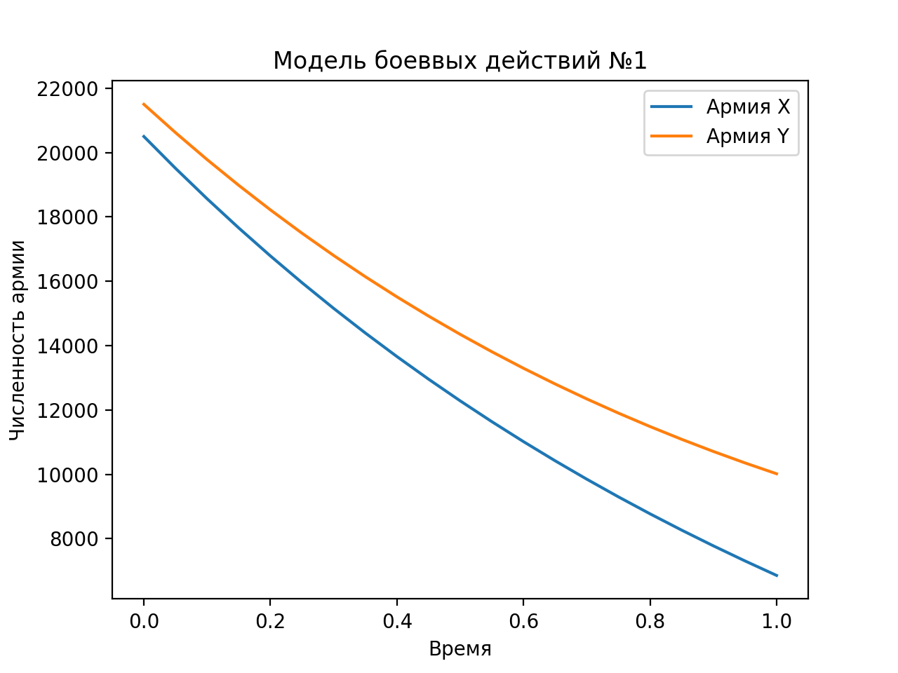
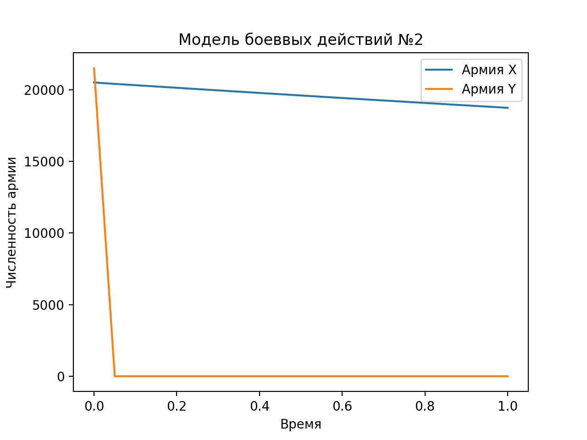

---
## Front matter
lang: ru-RU
title: Модель боевых действий
author: |
	Сорокин Андрей Константинович НФИбд-03-18\inst{}

institute: |
	\inst{}Российский Университет Дружбы Народов

## Formatting
mainfont: PT Serif
romanfont: PT Serif
sansfont: PT Sans
monofont: PT Mono
toc: false
slide_level: 2
theme: metropolis
header-includes: 
 - \metroset{progressbar=frametitle,sectionpage=progressbar,numbering=fraction}
 - '\makeatletter'
 - '\beamer@ignorenonframefalse'
 - '\makeatother'
aspectratio: 43
section-titles: true

---

## Цель работы

Рассмотреть некоторые простейшие модели боевых действий – модели Ланчестера и построить графики

## Условие задачи

Между страной $X$ и страной $Y$ идет война. Численность состава войск исчисляется от начала войны, и являются временными функциями $x(t)$ и $y(t)$
В начальный момент времени страна $X$ имеет армию численностью 20500 человек, а в распоряжении страны $Y$ армия численностью в 21500 человек.
Для упрощения модели считаем, что коэффициенты $a, b, c, h$ постоянны. 
Также считаем $P(t), Q(t)$ непрерывные функции.

# Ход выполнения лабораторной работы

 
## Модель боевых действий №1

В первом случае модель боевых действий между регулярными войсками описывается следующим образом
$$
 \begin{cases}
	\frac{dx}{dt}= -0.21(t)x(t) - 0.74(t)y(t) + sin(t)+0,5
	\\   
	\frac{dy}{dt}= -0,68(t)x(t) - 0,19(t)y(t) + cos(t)+0,5
 \end{cases}
$$

## Модель боевых действий № 2
Во втором случае в борьбу добавляются партизанские отряды. В результате модель принимает вид:
$$
 \begin{cases}
	\frac{dx}{dt}= -0.09(t)x(t) - 0.79(t)y(t) + sin(2t)
	\\   
	\frac{dy}{dt}= -0.62x(t)y(t) - 0.11y(t) + cos(2t)
 \end{cases}
$$

# Результаты

## Модель боевых действий между регулярными войсками
$$
 \begin{cases}
	\frac{dx}{dt}= -0.21(t)x(t) - 0.74(t)y(t) + sin(t)+0,5
	\\   
	\frac{dy}{dt}= -0,68(t)x(t) - 0,19(t)y(t) + cos(t)+0,5
 \end{cases}
$$

{ #fig:003 width=60% height=60% }

## Модель боевых действий между  войсками
$$
 \begin{cases}
	\frac{dx}{dt}= -0.09(t)x(t) - 0.79(t)y(t) + sin(2t)
	\\   
	\frac{dy}{dt}= -0.62x(t)y(t) - 0.11y(t) + cos(2t)
 \end{cases}
$$
{ #fig:004 width=60% height=60% }

# Выводы по проделанной работе

## Вывод

В результате проделанной лабораторной работы мы познакомились с простейшими моделями боевых действий
Проверили, как работает модель в различных ситуациях, построив графики $y(t)$ и $x(t)$ в рассматриваемых случаях
