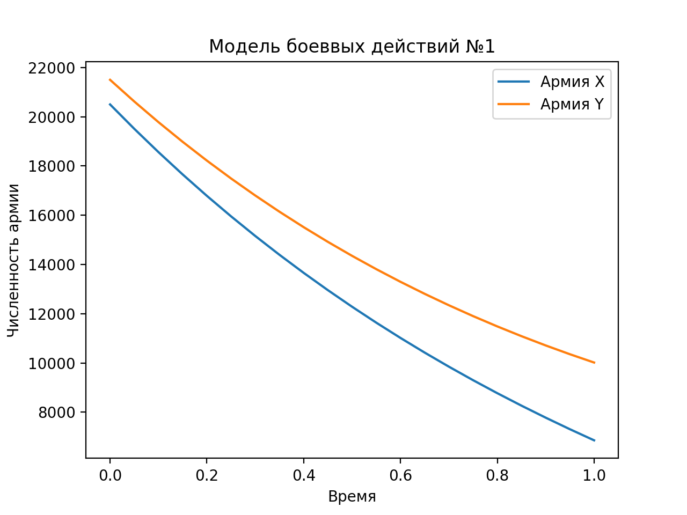
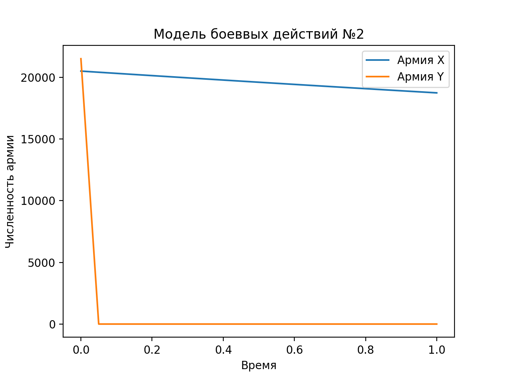

---
# Front matter
lang: ru-RU
title: "Отчет по лабораторной работе №3"
subtitle: "Модель боевых действий"
author: "Сорокин Андрей Константинович НФИбд-03-18"

# Formatting

lof: true # List of figures
fontsize: 14pt
linestretch: 1.5
papersize: a4paper
documentclass: scrreprt
polyglossia-lang: russian
polyglossia-otherlangs: english
mainfont: PT Serif
romanfont: PT Serif
sansfont: PT Sans
monofont: PT Mono
mainfontoptions: Ligatures=TeX
romanfontoptions: Ligatures=TeX
sansfontoptions: Ligatures=TeX,Scale=MatchLowercase
monofontoptions: Scale=MatchLowercase
indent: true
pdf-engine: lualatex
header-includes:
  - \linepenalty=10 # the penalty added to the badness of each line within a paragraph (no associated penalty node) Increasing the υalue makes tex try to haυe fewer lines in the paragraph.
  - \interlinepenalty=0 # υalue of the penalty (node) added after each line of a paragraph.
  - \hyphenpenalty=50 # the penalty for line breaking at an automatically inserted hyphen
  - \exhyphenpenalty=50 # the penalty for line breaking at an explicit hyphen
  - \binoppenalty=700 # the penalty for breaking a line at a binary operator
  - \relpenalty=500 # the penalty for breaking a line at a relation
  - \clubpenalty=150 # extra penalty for breaking after first line of a paragraph
  - \widowpenalty=150 # extra penalty for breaking before last line of a paragraph
  - \displaywidowpenalty=50 # extra penalty for breaking before last line before a display math
  - \brokenpenalty=100 # extra penalty for page breaking after a hyphenated line
  - \predisplaypenalty=10000 # penalty for breaking before a display
  - \postdisplaypenalty=0 # penalty for breaking after a display
  - \floatingpenalty = 20000 # penalty for splitting an insertion (can only be split footnote in standard LaTeX)
  - \raggedbottom # or \flushbottom
  - \usepackage{float} # keep figures where there are in the text
  - \floatplacement{figure}{H} # keep figures where there are in the text
---

# Цель работы

Рассмотрим некоторые простейшие модели боевых действий – модели Ланчестера. В противоборстве могут принимать участие, как регулярные войска, так и партизанские отряды. В общем случае главной характеристикой соперников являются численности сторон. Если в какой-то момент времени одна из численностей обращается в нуль, то данная сторона считается проигравшей (при условии, что численность другой стороны в данный момент положительна). 

# Выполнение лабораторной работы
## Задача

Между страной $X$ и страной $Y$ идет война. Численность состава войск исчисляется от начала войны, и являются временными функциями $x(t)$ и $y(t)$
В начальный момент времени страна $X$ имеет армию численностью 22022 человек, а в распоряжении страны $Y$ армия численностью в 33033 человек.
Для упрощения модели считаем, что коэффициенты $a, b, c, h$ постоянны. 
Также считаем $P(t), Q(t)$ непрерывные функции.
Постройте графики изменения численности войск армии $X$ и армии $Y$ для следующих случаев:
1. Модель боевых действий между регулярными войсками

$$
 \begin{cases}
	\frac{dx}{dt}= -0.21x(t) - 0.74y(t) + sin(t)+0.5
	\\   
	\frac{dy}{dt}= -0.68x(t) - 0.19y(t) + cos(t)+0.5
 \end{cases}
$$

{ #fig:003 width=70% height=70% }

Победа достается армии $Y$.

2. Модель ведение боевых действий с участием регулярных войск и партизанских отрядов

$$
 \begin{cases}
	\frac{dx}{dt}= -0.343x(t) - 0.895y(t) + 2sin(2t)
	\\   
	\frac{dy}{dt}= -0.699x(t)y(t) - 0.433y(t) + 2cos(t)
 \end{cases}
$$

{ #fig:004 width=70% height=70% }

Победа достается армии $X$.

## Код программы
```
import numpy as np
import matplotlib.pyplot as plt
from scipy.integrate import odeint

x0 = 20500
y0 = 21500
t0 = 0
a = 0.21
b = 0.74
c = 0.68
h = 0.19

tmax = 1
dt = 0.05

t = np.arange(t0, tmax+dt, dt)

def P1(t):
	return np.sin(t)+0.5

def Q1(t):
	return np.cos(t)+0.5

def f1(v, t):
	x, y=v
	return [-a * x - b * y +P1(t), -c * x - h * y +Q1(t)]

v0 = [x0,y0]
eq1 = odeint(f1, v0, t)

fig1, grph1 = plt.subplots()
grph1.plot(t, eq1[:, 0], label='Армия X')
grph1.plot(t, eq1[:, 1], label='Армия Y')
grph1.set_xlabel('Время')
grph1.set_ylabel('Численность армии')
grph1.set_title("Модель боеввых действий №1")
grph1.legend()

plt.show()

a = 0.09
b = 0.79
c = 0.62
h = 0.11

def P2(t):
	return np.sin(2*t)

def Q2(t):
	return np.cos(2*t)

def f2(v, t):
	x, y=v
	return [-a * x - b * y +P2(t), -c * x * y - h * y +Q2(t)]

eq2 = odeint(f2, v0, t)

fig2, grph2 = plt.subplots()
grph2.plot(t, eq2[:, 0], label='Армия X')
grph2.plot(t, eq2[:, 1], label='Армия Y')
grph2.set_xlabel('Время')
grph2.set_ylabel('Численность армии')
grph2.set_title("Модель боеввых действий №2")
grph2.legend()

plt.show()
```
# Вывод

В результате проделанной лабораторной работы мы познакомились с моделью «Войны и сражения». 
Проверили, как работает модель в различных ситуациях, построили графики $y(t)$ и $x(t)$ в рассматриваемых случаях.
