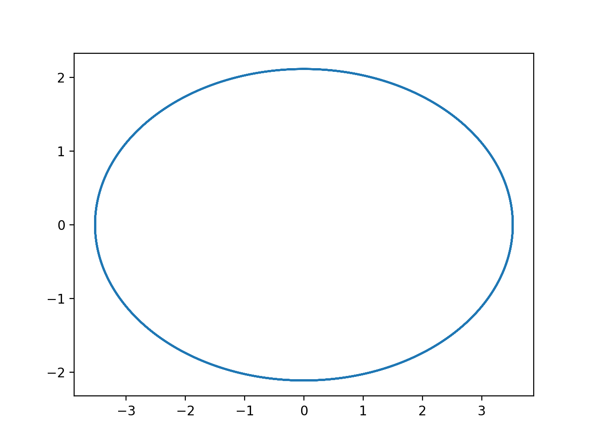
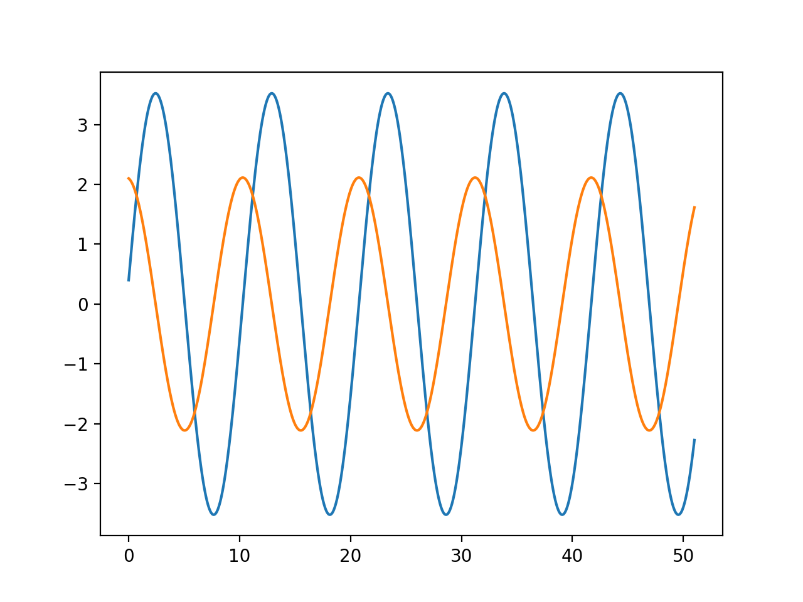
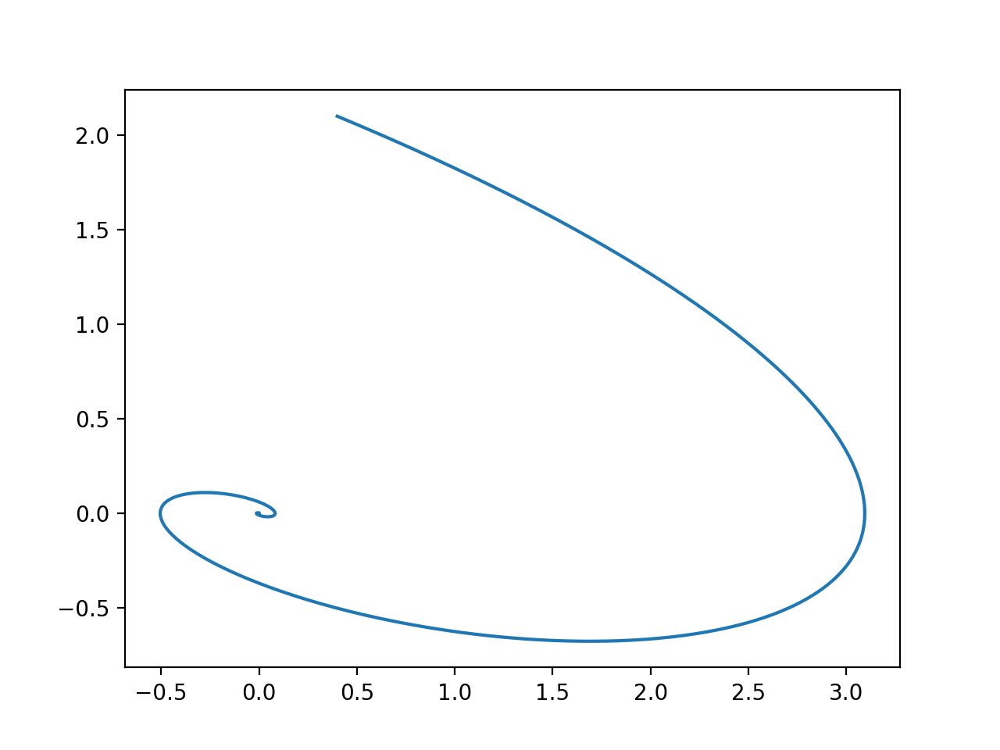
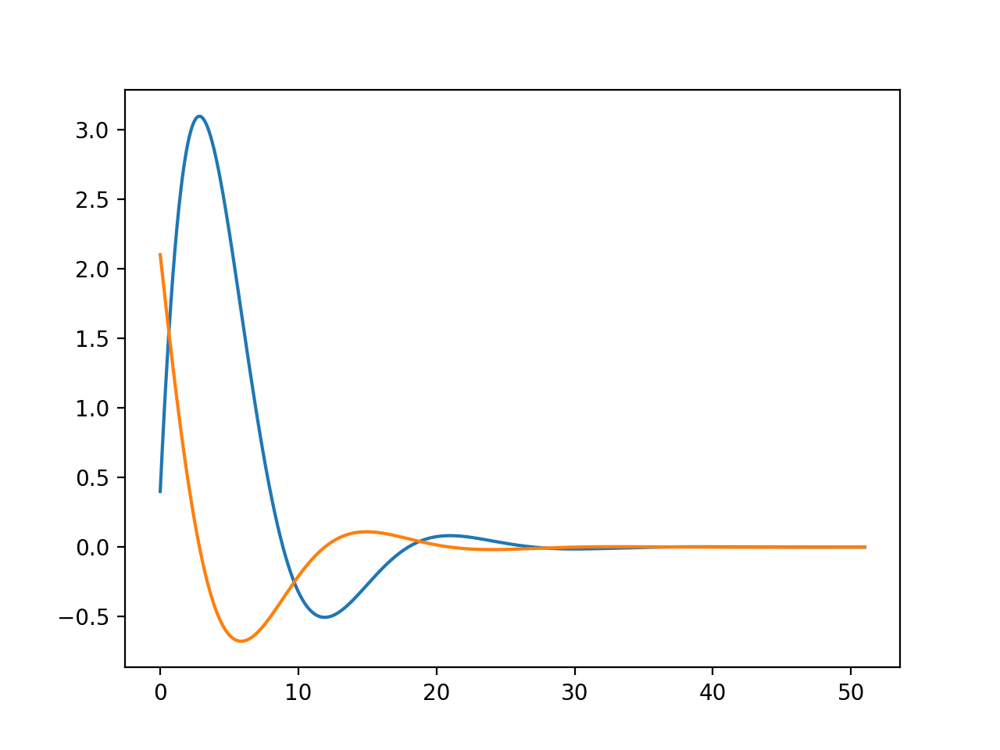
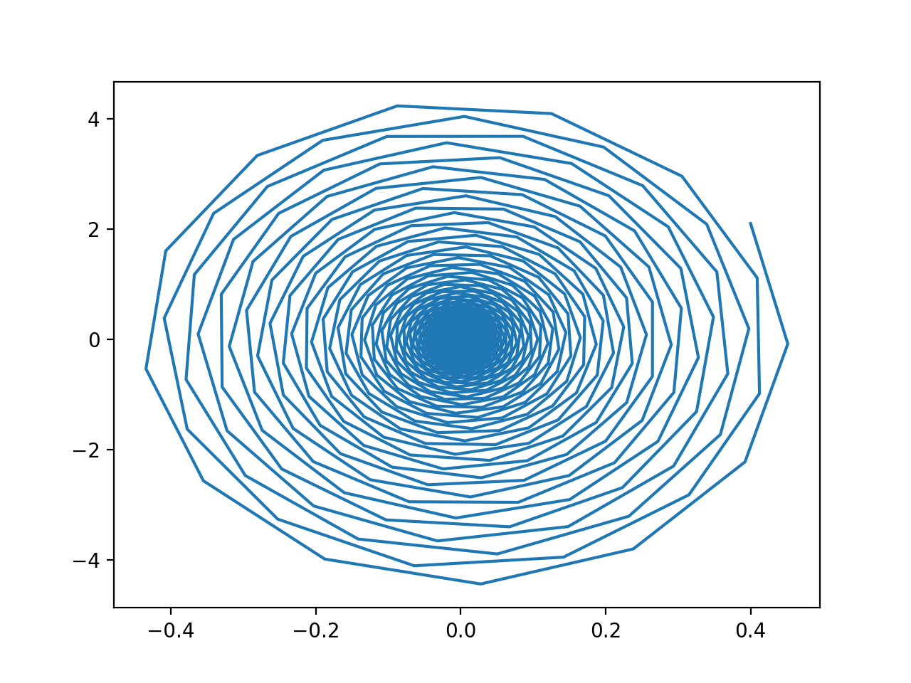
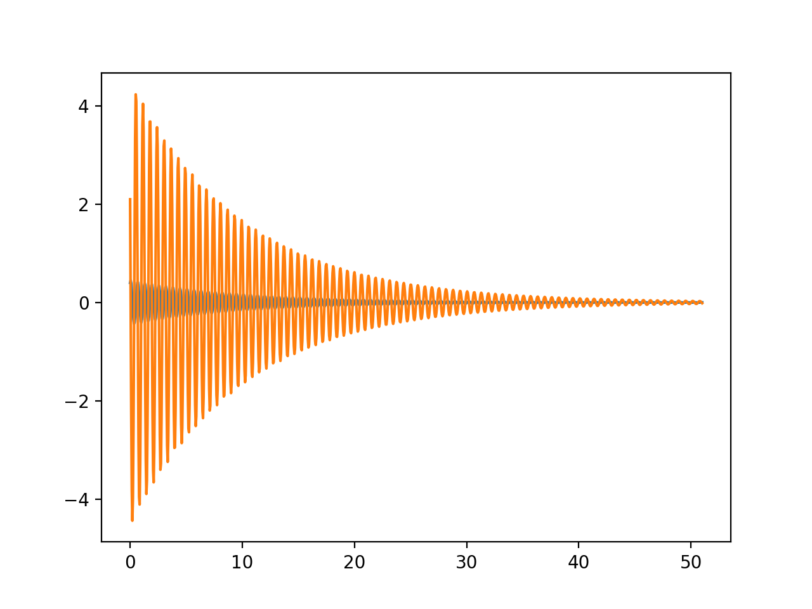

---
## Front matter
lang: ru-RU
title: "Модель гармонических колебаний"
subtitle: "*дисциплина: Математическое моделирование*"
author: "Сорокин Андрей Константинович НФИбд-03-18"


## Formatting
mainfont: PT Serif
romanfont: PT Serif
sansfont: PT Sans
monofont: PT Mono
toc: false
slide_level: 2
theme: metropolis
header-includes:
 - \metroset{progressbar=frametitle,sectionpage=progressbar,numbering=fraction}
 - '\makeatletter'
 - '\beamer@ignorenonframefalse'
 - '\makeatother'
aspectratio: 43
section-titles: true

---

## Цель работы

Ознакомиться с уравнением гармонического осциллятора и построить фазовые портреты.

## Задание
Построить фазовый портрет гармонического осциллятора и решение уравнения гармонического осциллятора на интервале $t\in[0;51]$
(шаг $0.05$) с начальными условиями $x_0=0.4, y_0=2.1$ для следующих случаев:
1. Колебания гармонического осциллятора без затуханий и без действий внешней силы $\ddot{x}+0.6x=0$

2. Колебания гармонического осциллятора c затуханием и без действий внешней силы $\ddot{x}+0.4\dot{x}+0.4x=0$

3. Колебания гармонического осциллятора c затуханием и под действием внешней силы $\ddot{x}+0.2\dot{x}+10x=0.5cos(2t)$

## Ход выполнения лабораторной работы

Подключаю все необходимые библиотеки
```
import numpy as np
import matplotlib.pyplot as plt
from scipy.integrate import odeint
```

## Значения
Ввод значений из своего варианта
Значения для 21 варианта:
```
x0 = 0.4
y0 = 2.1

t0 = 0
tmax = 51
dt = 0.05

t = np.arange(t0,tmax+dt,dt)
v0 = [x0,y0]
```
## Первый случай
Ввожу параметры осциллятора для первого случая:

```
w = 0.6
g = 0
```
## Первый случай
Система для первого случая:
```
def y(v,t):
	x, y = v
	return [y, -1 * np.power(w,2) * x  - g * y]

eq1 = odeint(y,v0,t)
```

## Графики первого случая
Вывод фазового портрета гармонических колебаний для первого случая (рис. 1).
{ #fig:001 width=70% height=70% }

## Графики первого случая
Вывод решения уравнения гармонического осциллятора первого случая (рис. 2).
{ #fig:002 width=70% height=70% }

## Второй случай
Ввожу параметры осциллятора для второго случая:
```
w = 0.4
g = 0.4
```
## Графики второго случая
Вывод фазового портрета гармонических колебаний для второго случая (рис. 3).
{ #fig:003 width=70% height=70% }

## Графики второго случая
Вывод решения уравнения гармонического осциллятора для задания №2 (рис. 4).
{ #fig:004 width=70% height=70% }

## Третий случай
Ввожу параметры осциллятора третьего случая:
```
w = 10
g = 0.2
```
## Третий случай
Зададим дополнительную функцию f:
```
def f(t):
	return 0.5 * cos(2*t)
```
## Третий случай
Система для третьего случая:
```
def y2(v,t):
	x, y = v
	return [y, -1 * np.power(w,2) * x  - g * y - f(t)]
```
## Графики третьего случая
Вывод фазового портрета гармонических колебаний для третьего случая(рис. 5).
{ #fig:005 width=70% height=70% }

## Графики третьего случая
Вывод решения уравнения гармонического осциллятора для третьего слкчая (рис. 6).
{ #fig:003 width=70% height=70%}

## Вывод

В результате проделаной работы я ознакомился с моделью гармонических колебаний и построил фазовые портреты гармонических колебаний.
