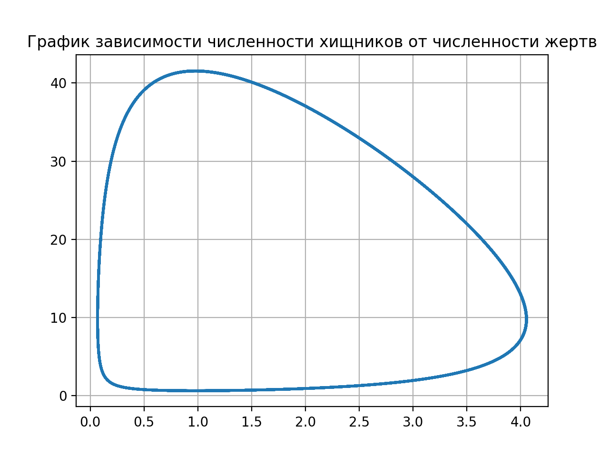
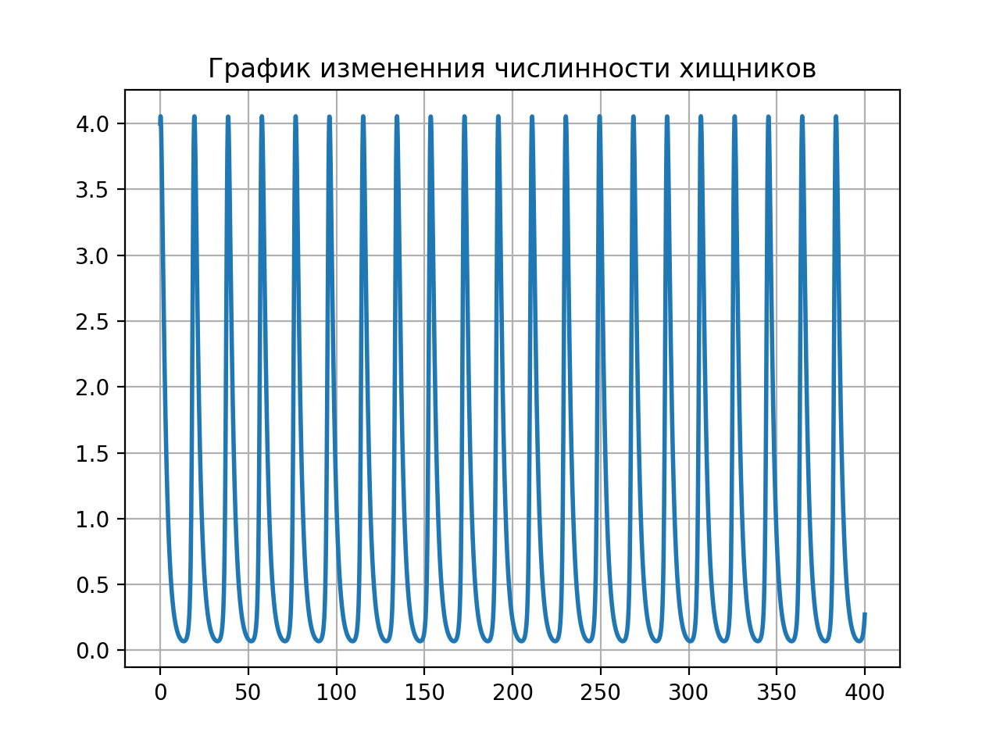
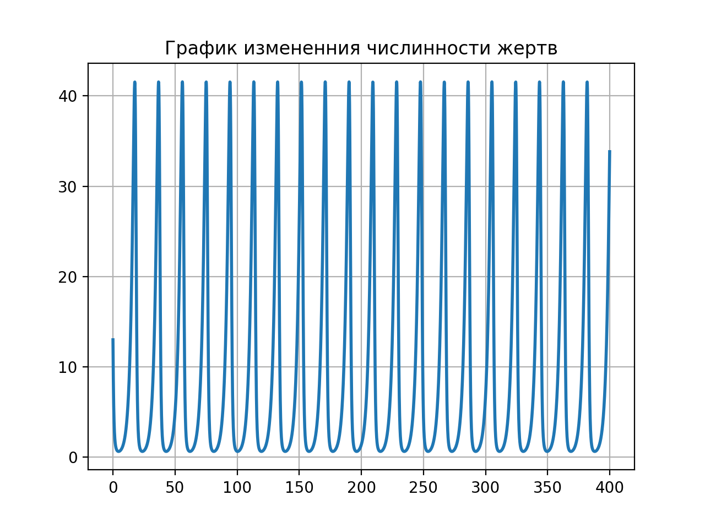

---
## Front matter
lang: ru-RU
title: Модель хищник-жертва
author: Сорокин Андрей Константинович
institute: RUDN University, Moscow, Russian Federation
groupe: НФИбд-03-18
date: 13 марта 2021

## Formatting
toc: false
slide_level: 2
theme: metropolis
header-includes: 
 - \metroset{progressbar=frametitle,sectionpage=progressbar,numbering=fraction}
 - '\makeatletter'
 - '\beamer@ignorenonframefalse'
 - '\makeatother'
aspectratio: 43
section-titles: true

---

## Цель работы

Рассмотреть модель Лотки-Вольтерры, построить график зависимости численности хищников от численности жертв, численности видов при заданных начальных условиях. Найти стационарное состояние системы.

## Задача

Для модели «хищник-жертва»:

$$\begin{cases}
\frac{dx}{dt}=-0.42x(t)+0.043x(t)y(t)\\
\frac{dy}{dt}=0.44y(t)-0.045x(t)y(t)
\end{cases}$$

Построить график зависимости численности хищников от численности жертв, графики изменения численности хищников и численности жертв при следующих начальных условиях: $x_0=4$, $y_0=13$. Найти стационарное состояние системы.

## График 1

Посредством решения системы дифференциальных уравнений получим следующий график (рис.1):
{ #fig:001 width=60% }

## График 2
Построим график изменения численности хищников при заданных начальных условиях (рис.2):
{ #fig:002 width=60% }

## График 3
Построим график изменения численности жертв при заданных начальных условиях (рис.3):
{ #fig:003 width=50% }

## Стационарное состояние системы

Система будет стационарна в точке с координатами (0.9777777777777777 9.767441860465116)

## Выводы

В результате проделанной работы мы рассмотрели модель Лотки-Вольтерры, построили график зависимости численности хищников от численности жертв. Построили график изменения численности видов при заданных начальных условиях. Нашли стационарное состояние системы.

