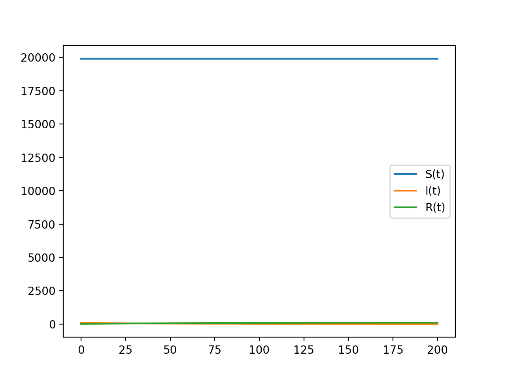
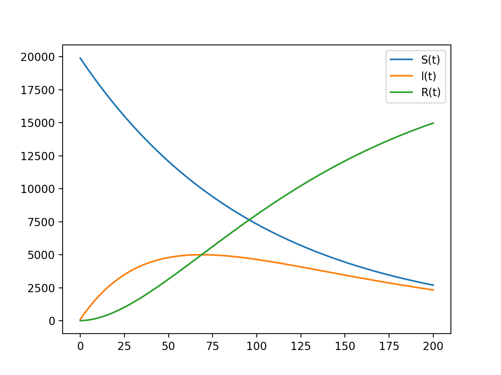

---
## Front matter
lang: ru-RU
title: "Модель эпидемия"
subtitle: "*дисциплина: Математическое моделирование*"
author: "Сорокин Андрей Константинович"
date: 20 Марта 2021

## Formatting
mainfont: PT Serif
romanfont: PT Serif
sansfont: PT Sans
monofont: PT Mono
toc: false
slide_level: 2
theme: metropolis
header-includes:
 - \metroset{progressbar=frametitle,sectionpage=progressbar,numbering=fraction}
 - '\makeatletter'
 - '\beamer@ignorenonframefalse'
 - '\makeatother'
aspectratio: 43
section-titles: true

---

## Цель работы

Изучить модель "эпидемия" и построить графики по этой модели.

## Задание
Построить графики изменения числа особей в каждой из трех групп в случае:  
1)$I(0) \leq I^*$  
2)$I(0) > I^*$  
При  $N = 12800,I(0) = 180,R(0)=58$
$$\frac{{d}S}{{d}t} = 
\begin{cases}
-0.01S,I(t) > I^*\\
0,I(t) \leq I^*
\end{cases}$$

$$\frac{{d}I}{{d}t} = 
\begin{cases}
0.01S - 0.02I,I(t) > I^*\\
-0.02 I,I(t) \leq I^*
\end{cases}$$
$$\frac{{d}R}{{d}t} = 0.02I$$

## Подключаю библиотеки

```
import numpy as np
import matplotlib.pyplot as plt
from scipy.integrate import odeint
```

## Ввожу значений
```
a = 0.01
b = 0.02
N = 20000
I = 99
R = 5
S = N - I - R
t = np.arange(0,200,0.01)
v = [S, I, R]
```

## Функция для первого случая
```
def f1(v,t):
	dS = 0
	dI = -1*b*v[1]
	dR = b*v[1]
	return [dS,dI,dR]
```

## Функция для второго
```
def f2(v,t):
	dS = -1*a*v[0]
	dI = a*v[0] - b*v[1]
	dR = b*v[1]
	return [dS,dI,dR]
```

## Вывод графика №1

Вывод графика изменения числа особей в каждой из трех групп для первого случая (рис. 1).

{#fig:001 width=70% }

## Вывод графика №2

Вывод графика изменения числа особей в каждой из трех групп для второго случая (рис. 2).

{#fig:002 width=70% }

## Вывод

В результате проделанной работы я изучил модель "эпидемия" и построил графики по этой модели.
