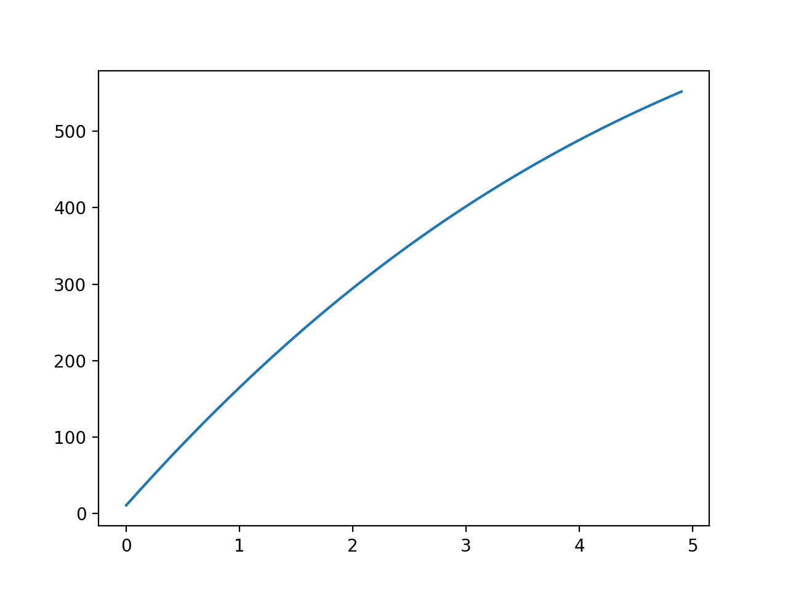
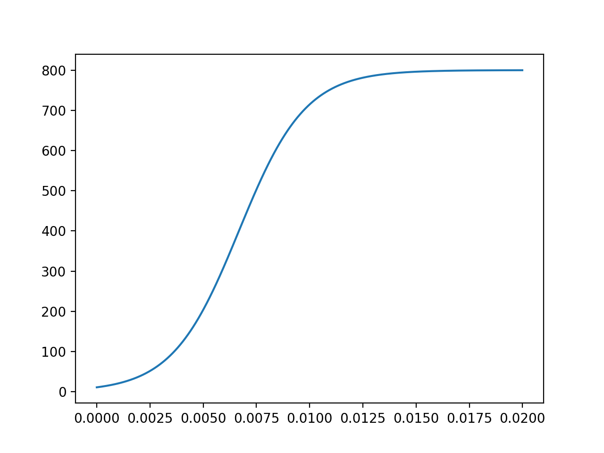
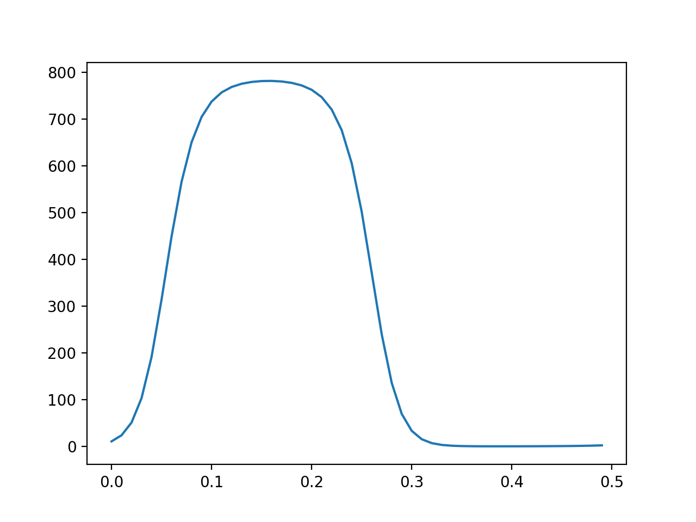

---
## Front matter
lang: ru-RU
title: "Эффективность рекламы"
subtitle: "*дисциплина: Математическое моделирование*"
author: "Сорокин Андрей Константинович"
date: 27 марта, 2021

## Formatting
mainfont: PT Serif
romanfont: PT Serif
sansfont: PT Sans
monofont: PT Mono
toc: false
slide_level: 2
theme: metropolis
header-includes:
 - \metroset{progressbar=frametitle,sectionpage=progressbar,numbering=fraction}
 - '\makeatletter'
 - '\beamer@ignorenonframefalse'
 - '\makeatother'
aspectratio: 43
section-titles: true

---

## Цель работы

Рассмотреть модель "Эффективность рекламы" и построить графики по этой модели.

## Задание
Построить график распространения рекламы, математическая модель которой описывается
следующим уравнением:  
1.$$\frac{{d}n}{{d}t} = (0.21 + 0.00008 n(t))(N - n(t))$$  
2.$$\frac{{d}n}{{d}t} = (0.000012 + 0.8 n(t))(N - n(t))$$  
3.$$\frac{{d}n}{{d}t} = (0.1\sin(t) + 0.1\cos(10t) n(t))(N - n(t))$$

При следующих начальных условиях: $N = 800, n(t) = 11$.

## Подключаю все необходимые библиотеки

```
import numpy as np
import matplotlib.pyplot as plt
from scipy.integrate import odeint
```

## Ввожу значения для первого случая:
```
a_1 = 0.21
a_2 = 0.00008
t = np.arange(0,5,0.1)
```
## Задаю функцию f:

```
def f(n,t):
	dn = (a_1 + a_2*n)*(N-n)
	return dn
res = odeint(f,n,t)
```

## График №1

Вывод графика распространения рекламы(рис. 1).

{#fig:001 width=70% }


## Ввод значений из своего варианта для второго случая
```
a_1 = 0.000012
a_2 = 0.8
t = np.arange(0,0.02,0.00001)
```

## Задаю функцию f и вывожу момент времени:
```
def f(n,t):
	dn = (a_1+a_2*n)*(N-n)
	global dn_max
	if dn > dn_max[0]:
		dn_max = [dn,t]
	return dn

res = odeint(f,n,t)
print(dn_max[1])
```

## Вывод графика

Вывод графика распространения рекламы(рис. 2).

{#fig:002 width=70% }


## Вывод времени

Момент времени с максимальной скоростью распространения рекламы: 0.006781294076748116

## Ввожу значений из своего варианта для третьего случая:
```
a_1 = 0.1
a_2 = 0.1
t = np.arange(0,0.5,0.01)
```
## Вывод графика:

Вывод графика распространения рекламы(рис. 3).

{#fig:004 width=70% }

## Вывод

В результате проделаной работы мы рассмотрели модель эффективности рекламной компании и построили графики для трёх случаев.
