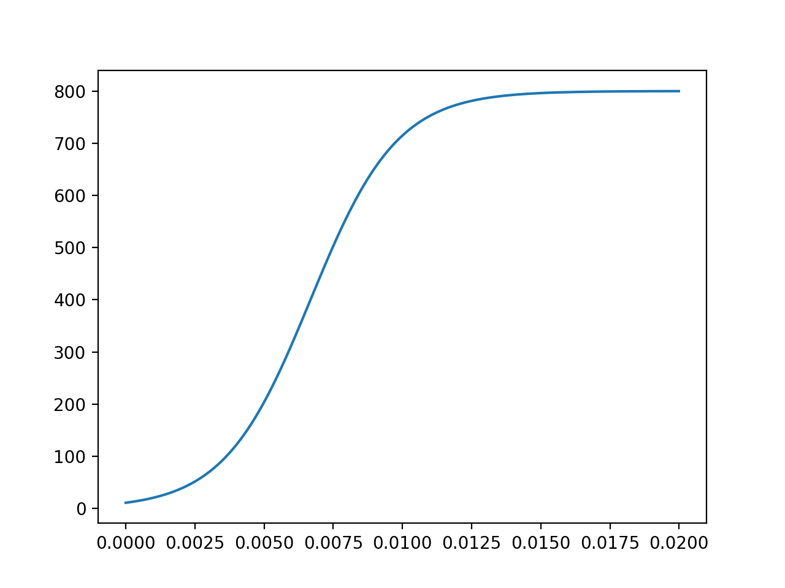
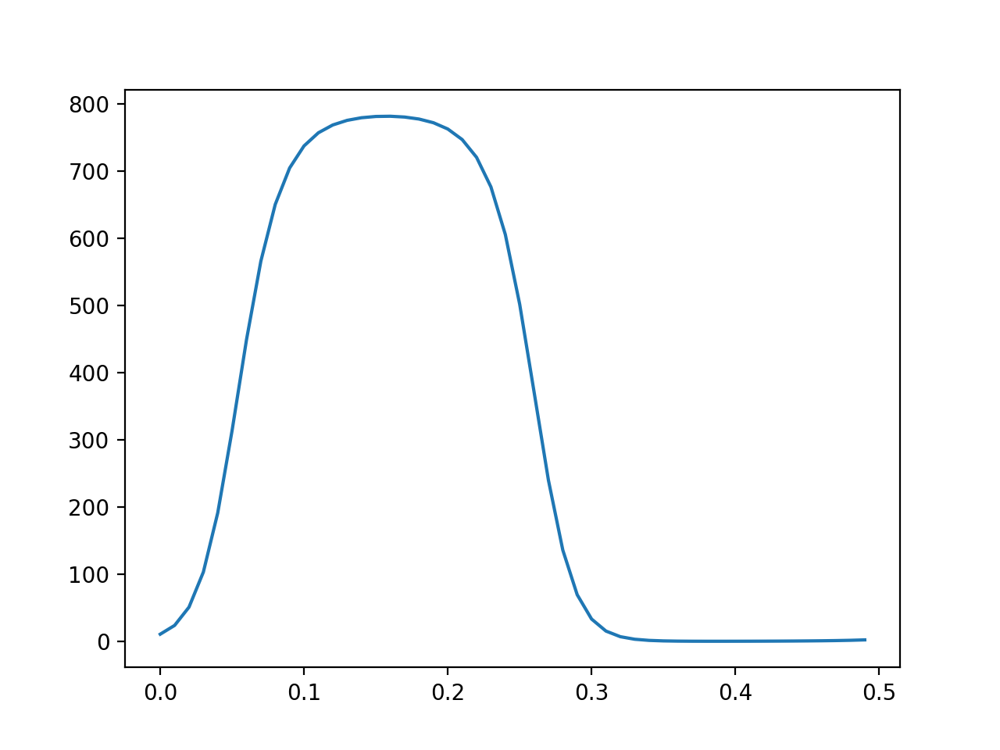

---
# Front matter
lang: ru-RU
title: "Отчет по лабораторной работе №7"
subtitle: "Эффективность рекламы"
author: "Сорокин Андрей Константинович"
group: "НФИбд-03-18"
ID: "1032180470"


# Formatting
toc-title: "Содержание"
toc: true # Table of contents
toc_depth: 2
lof: true # List of figures
fontsize: 12pt
linestretch: 1.5
papersize: a4paper
documentclass: scrreprt
polyglossia-lang: russian
polyglossia-otherlangs: english
mainfont: PT Serif
romanfont: PT Serif
sansfont: PT Sans
monofont: PT Mono
mainfontoptions: Ligatures=TeX
romanfontoptions: Ligatures=TeX
sansfontoptions: Ligatures=TeX,Scale=MatchLowercase
monofontoptions: Scale=MatchLowercase
indent: true
pdf-engine: lualatex
header-includes:
  - \linepenalty=10 # the penalty added to the badness of each line within a paragraph (no associated penalty node) Increasing the value makes tex try to have fewer lines in the paragraph.
  - \interlinepenalty=0 # value of the penalty (node) added after each line of a paragraph.
  - \hyphenpenalty=50 # the penalty for line breaking at an automatically inserted hyphen
  - \exhyphenpenalty=50 # the penalty for line breaking at an explicit hyphen
  - \binoppenalty=700 # the penalty for breaking a line at a binary operator
  - \relpenalty=500 # the penalty for breaking a line at a relation
  - \clubpenalty=150 # extra penalty for breaking after first line of a paragraph
  - \widowpenalty=150 # extra penalty for breaking before last line of a paragraph
  - \displaywidowpenalty=50 # extra penalty for breaking before last line before a display math
  - \brokenpenalty=100 # extra penalty for page breaking after a hyphenated line
  - \predisplaypenalty=10000 # penalty for breaking before a display
  - \postdisplaypenalty=0 # penalty for breaking after a display
  - \floatingpenalty = 20000 # penalty for splitting an insertion (can only be split footnote in standard LaTeX)
  - \raggedbottom # or \flushbottom
  - \usepackage{float} # keep figures where there are in the text
  - \floatplacement{figure}{H} # keep figures where there are in the text
---

# Цель работы

Рассмотреть модель "Эффективность рекламы" и построить графики по этой модели.

# Задание
Построить график распространения рекламы, математическая модель которой описывается
следующим уравнением:  
1.$$\frac{{d}n}{{d}t} = (0.21 + 0.00008 n(t))(N - n(t))$$  
2.$$\frac{{d}n}{{d}t} = (0.000012 + 0.8 n(t))(N - n(t))$$  
3.$$\frac{{d}n}{{d}t} = (0.1\sin(t) + 0.1\cos(10t) n(t))(N - n(t))$$

При следующих начальных условиях: $N = 800, n(t) = 11$.

# Теоретическая справка
Предположим, что торговыми учреждениями реализуется некоторая продукция, о которой в момент времени $t$ из числа потенциальных покупателей $N$ знает лишь $n$ покупателей. Для ускорения сбыта продукции запускается реклама по радио, телевидению и других средств массовой информации. После запуска рекламной кампании информация о продукции начнет распространяться среди потенциальных покупателей путем общения друг с другом. Таким образом, после запуска рекламных объявлений скорость изменения числа знающих о продукции людей пропорциональна как числу знающих о товаре покупателей, так и числу покупателей о нем не знающих
Модель рекламной кампании описывается следующими величинами. Считаем, что $$\frac{{d}n}{{d}t}$$ - скорость изменения со временем числа потребителей, узнавших о товаре и готовых его купить, $t$ - время, прошедшее с начала рекламной кампании, $n(t)$ - число уже информированных клиентов. Эта величина пропорциональна числу покупателей, еще не знающих о нем, это описывается следующим образом: $\alpha_1 (t)(N - n(t))$, где $N$ - общее число потенциальных платежеспособных покупателей, $\alpha_1 (t) > 0$ - характеризует интенсивность рекламной кампании (зависит от затрат на рекламу в данный момент времени). Помимо этого, узнавшие о товаре потребители также распространяют полученную информацию среди потенциальных покупателей, не знающих о нем (в этом случае работает т.н. сарафанное радио). Этот вклад в рекламу описывается величиной $\alpha_2 (t)n(t)(N - n(t))$, эта величина увеличивается с увеличением потребителей узнавших о товаре. Математическая модель распространения рекламы описывается уравнением: $$\frac{{d}n}{{d}t} = (\alpha_1 (t) + \alpha_2 (t)n(t))(N - n(t))$$

# Выполнение лабораторной работы

## Подключаю необходимые библиотеки

```
import numpy as np
import matplotlib.pyplot as plt
from scipy.integrate import odeint
```

## Случай №1
### Ввожу значения для первого случая:
```
a_1 = 0.21
a_2 = 0.00008
t = np.arange(0,5,0.1)
```
### Задаю функцию f:
```
def f(n,t):
	dn = (a_1 + a_2*n)*(N-n)
	return dn
res = odeint(f,n,t)
```
### Вывод графика:

Вывод графика распространения рекламы(рис. -@fig:001).

{#fig:001 width=70% }

## Случай №2
### Ввожу значений из своего варианта для второго случая:
```
a_1 = 0.000012
a_2 = 0.8
t = np.arange(0,0.02,0.00001)
```

### Задаю функцию f и вывожу момент времени:
```
def f(n,t):
	dn = (a_1+a_2*n)*(N-n)
	global dn_max
	if dn > dn_max[0]:
		dn_max = [dn,t]
	return dn

res = odeint(f,n,t)
print(dn_max[1])
```
### Вывод графика:

Вывод графика распространения рекламы(рис. -@fig:002).

{#fig:002 width=70% }

Момент времени с максимальной скоростью распространения рекламы: 0.006781294076748116

## Случай №3

### Ввожу значений из своего варианта для третьего случая:
```
a_1 = 0.1
a_2 = 0.1
t = np.arange(0,0.5,0.01)
```

### Задаю функцию f для третьего случая:
```
def f2(n,t):
	dn = (a_1*np.sin(t)+a_2*np.cos(10*t)*n)*(N-n)
	return dn
```


### Вывод графика:

Вывод графика распространения рекламы(рис. -@fig:003).

{#fig:004 width=70% }


# Выводы

В результате проделаной работы мы рассмотрели модель эффективности рекламной компании и построили графики для трёх случаев.
