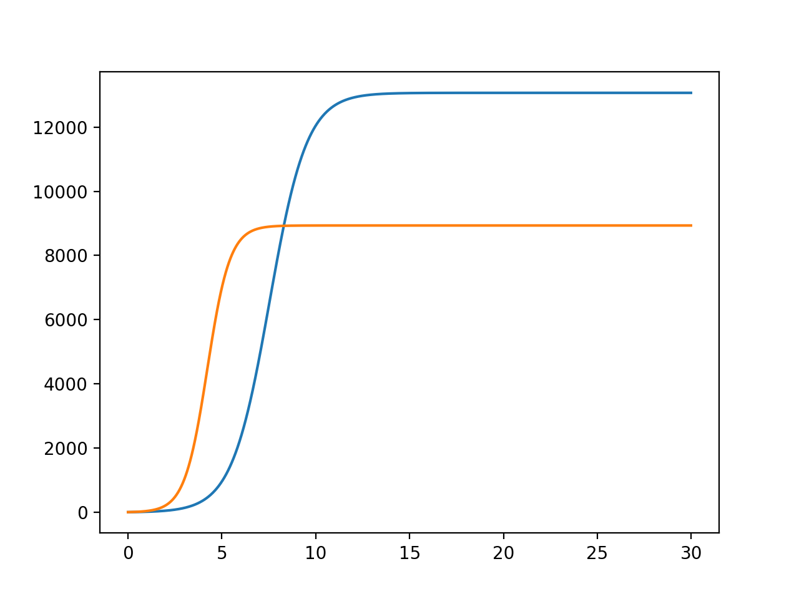
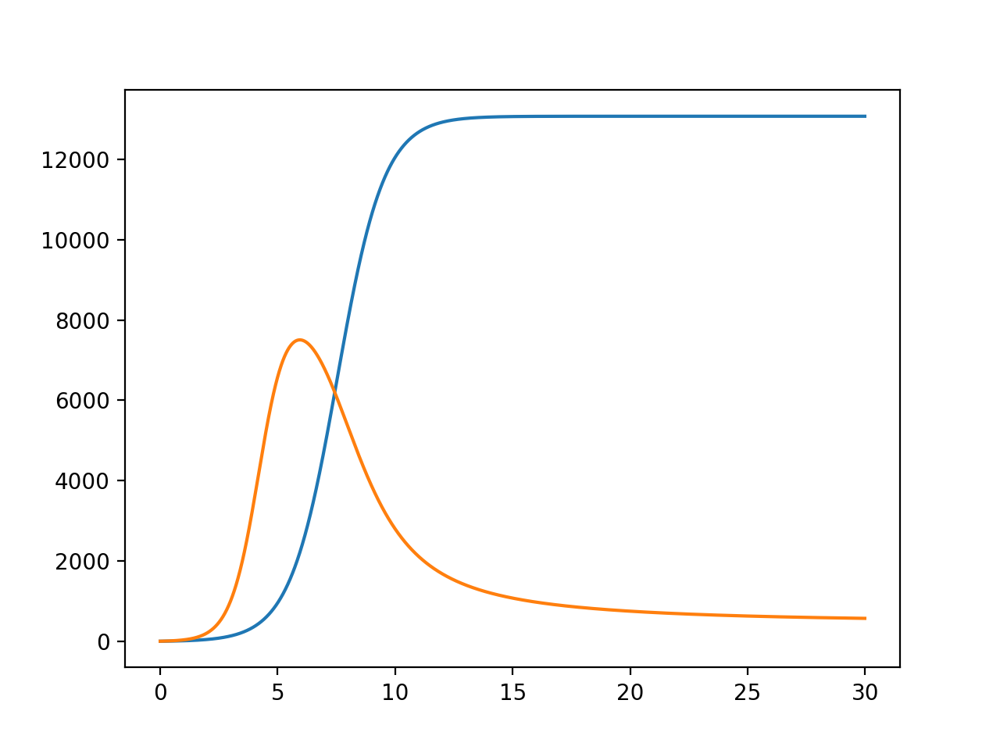

---
## Front matter
lang: ru-RU
title: Модель конкуренции двух фирм
author: Сорокин Андрей Константинович
institute: RUDN University, Moscow, Russian Federation
groupe: НФИбд-03-18
date: 3 апреля 2021

## Formatting
toc: false
slide_level: 2
theme: metropolis
header-includes: 
 - \metroset{progressbar=frametitle,sectionpage=progressbar,numbering=fraction}
 - '\makeatletter'
 - '\beamer@ignorenonframefalse'
 - '\makeatother'
aspectratio: 43
section-titles: true

---

## Цель работы

Рассмотреть модель конкуренции двух фирм, построить графики для двух случаев.

## Задание

Случай 1.

$$ \frac{\partial{M_1}}{\partial{\theta}} \ = \ M_1 - \frac{b}{c_1}M_1*M_2 - \frac{a_1}{c_1}M_1^2 \ $$

$$ \frac{\partial{M_2}}{\partial{\theta}} \ = \ \frac{c_2}{c_1}M_2 - \frac{b}{c_1}M_1M_2 - \frac{a_2}{c_1}*M_2^2 \ $$

Случай 2. 

$$ \frac{\partial{M_1}}{\partial{\theta}} \ = \ M_1 - (\frac{b}{c_1} + 0.00012)M_1M_2 - \frac{a_1}{c_1}M_1^2 \ $$

$$ \frac{\partial{M_2}}{\partial{\theta}} \ = \ \frac{c_2}{c_1}M_2 - \frac{b}{c_1}M_1*M_2 - \frac{a_2}{c_1}*M_2^2 \ $$

## Задание

Соответствующие начальные условия и параметры для обоих случаев:

$$M^1_0 = 7, M_0^2 = 8$$ $$p_{cr}=45, N=70, q=1$$ $$\tau_1 = 25, \tau_2 = 20$$ $$p_1 = 10, p_2 = 7.7$$

## График 1

Построим график изменения оборотных средств фирм для первого случая. (рис.1):
{ #fig:001 width=70% }

## График 2

Построим график изменения оборотных средств фирм для второго случая. (рис.2):
{ #fig:002 width=70% }

## Вывод

В результате проделанной работы я рассмотрел модель конкуренции двух фирм и построил графики для двух случаев.

