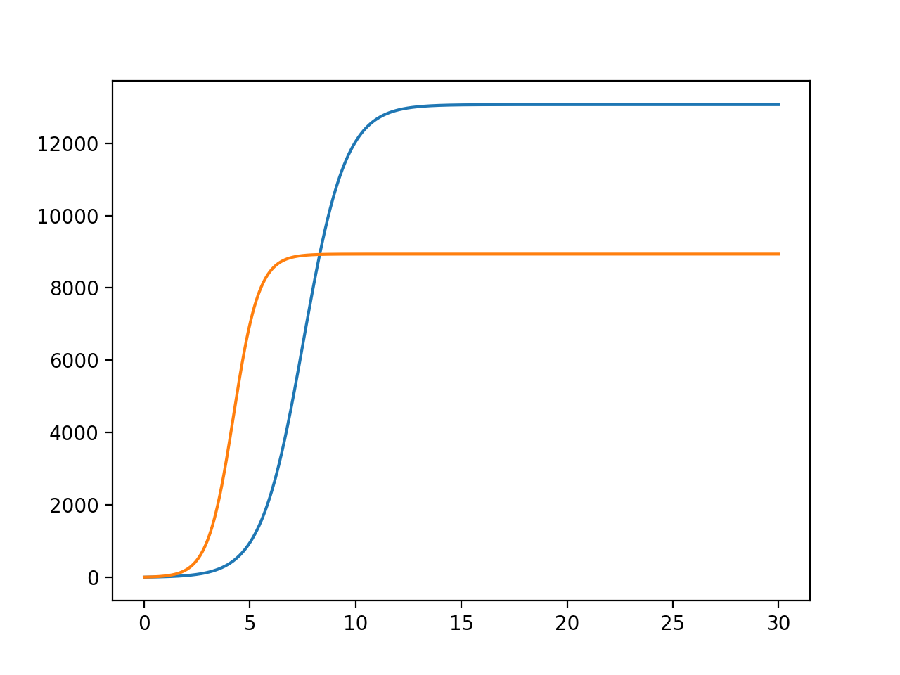

---
# Front matter
lang: ru-RU
title: "Отчет по лабораторной работе №8"
subtitle: "Модель конкуренции двух фирм"
author: "Сорокин Андрей Константинович"
group: "НФИбд-03-18"
ID: "1032180470"


# Formatting
toc-title: "Содержание"
toc: true # Table of contents
toc_depth: 2
lof: true # List of figures
fontsize: 12pt
linestretch: 1.5
papersize: a4paper
documentclass: scrreprt
polyglossia-lang: russian
polyglossia-otherlangs: english
mainfont: PT Serif
romanfont: PT Serif
sansfont: PT Sans
monofont: PT Mono
mainfontoptions: Ligatures=TeX
romanfontoptions: Ligatures=TeX
sansfontoptions: Ligatures=TeX,Scale=MatchLowercase
monofontoptions: Scale=MatchLowercase
indent: true
pdf-engine: lualatex
header-includes:
  - \linepenalty=10 # the penalty added to the badness of each line within a paragraph (no associated penalty node) Increasing the value makes tex try to have fewer lines in the paragraph.
  - \interlinepenalty=0 # value of the penalty (node) added after each line of a paragraph.
  - \hyphenpenalty=50 # the penalty for line breaking at an automatically inserted hyphen
  - \exhyphenpenalty=50 # the penalty for line breaking at an explicit hyphen
  - \binoppenalty=700 # the penalty for breaking a line at a binary operator
  - \relpenalty=500 # the penalty for breaking a line at a relation
  - \clubpenalty=150 # extra penalty for breaking after first line of a paragraph
  - \widowpenalty=150 # extra penalty for breaking before last line of a paragraph
  - \displaywidowpenalty=50 # extra penalty for breaking before last line before a display math
  - \brokenpenalty=100 # extra penalty for page breaking after a hyphenated line
  - \predisplaypenalty=10000 # penalty for breaking before a display
  - \postdisplaypenalty=0 # penalty for breaking after a display
  - \floatingpenalty = 20000 # penalty for splitting an insertion (can only be split footnote in standard LaTeX)
  - \raggedbottom # or \flushbottom
  - \usepackage{float} # keep figures where there are in the text
  - \floatplacement{figure}{H} # keep figures where there are in the text
---

# Цель работы

Рассмотреть модель конкуренции двух фирм, построить графики для двух случаев.

# Задание

Построить график конкуренции двух фирм, для двух случаев:  
Случай 1:

$$ \frac{\partial{M_1}}{\partial{\theta}} \ = \ M_1 - \frac{b}{c_1}M_1*M_2 - \frac{a_1}{c_1}M_1^2 \ $$

$$ \frac{\partial{M_2}}{\partial{\theta}} \ = \ \frac{c_2}{c_1}M_2 - \frac{b}{c_1}M_1M_2 - \frac{a_2}{c_1}*M_2^2 \ $$

Случай 2: 

$$ \frac{\partial{M_1}}{\partial{\theta}} \ = \ M_1 - (\frac{b}{c_1} + 0.00012)M_1M_2 - \frac{a_1}{c_1}M_1^2 \ $$

$$ \frac{\partial{M_2}}{\partial{\theta}} \ = \ \frac{c_2}{c_1}M_2 - \frac{b}{c_1}M_1*M_2 - \frac{a_2}{c_1}*M_2^2 \ $$

Соответствующие начальные условия и параметры для обоих случаев:

$$M^1_0 = 7, M_0^2 = 8$$ $$p_{cr}=45, N=70, q=1$$ $$\tau_1 = 25, \tau_2 = 20$$ $$p_1 = 10, p_2 = 7.7$$


# Теоретическая справка
## Случай 1

Рассмотрим две фирмы, производящие взаимозаменяемые товары одинакового качества и находящиеся в одной рыночной нише. Последнее означает, что у потребителей в этой нише нет априорных предпочтений, и они приобретут тот или иной товар, не обращая внимания на знак фирмы.

В этом случае, на рынке устанавливается единая цена, которая определяется балансом суммарного предложения и спроса. Иными словами, в рамках нашей модели конкурентная борьба ведётся только рыночными методами. То есть, конкуренты могут влиять на противника путем изменения параметров своего производства: себестоимость, время цикла, но не могут прямо вмешиваться в ситуацию на рынке («назначать» цену или влиять на потребителей каким-либо иным способом.)

Уравнения динамики оборотных средств запишем по аналогии с (2) в виде
$$\frac{dM_1}{dt}=-\frac{M_1}{\tau_1}+N_1q\bigg(1-\frac{p}{p_{cr}}\bigg)p-\kappa_1$$
$$\frac{dM_2}{dt}=-\frac{M_2}{\tau_2}+N_2q\bigg(1-\frac{p}{p_{cr}}\bigg)p-\kappa_2\quad$$
$$(10)$$
где использованы те же обозначения, а индексы 1 и 2 относятся к первой и второй фирме, соответственно. Величины $N1$ и $N2$ – числа потребителей, приобретших товар первой и второй фирмы.

Учтем, что товарный баланс устанавливается быстро, то есть произведенный каждой фирмой товар не накапливается, а реализуется по цене $p$.

Тогда
$$\frac{M_1}{\tau_1\tilde{p}_1}=N_1q\bigg(1-\frac{p}{p_{cr}}\bigg)$$
$$\frac{M_2}{\tau_2\tilde{p}_2}=N_2q\bigg(1-\frac{p}{p_{cr}}\bigg)$$
$$(11)$$
где $\tilde{p}_1$ и $\tilde{p}_2$ – себестоимости товаров в первой и второй фирме.

С учетом (10) представим (11) в виде
$$\frac{dM_1}{dt}=-\frac{M_1}{\tau_1}\bigg(1-\frac{p}{\tilde{p}_1}\bigg)-\kappa_1$$
$$\frac{dM_2}{dt}=-\frac{M_2}{\tau_2}\bigg(1-\frac{p}{\tilde{p}_2}\bigg)-\kappa_1$$
$$(12)$$

Уравнение для цены, по аналогии с (3),
$$\frac{dp}{dt}=-\gamma\bigg(\frac{M_1}{\tau_1\tilde{p}_1}+\frac{M_2}{\tau_2\tilde{p}_2}-Nq\bigg(1-\frac{p}{p_{cr}}\bigg)\bigg)\quad(13)$$
Считая, как и выше, что ценовое равновесие устанавливается быстро, получим:
$$p=p_{cr}\bigg(1-\frac{1}{Nq}\bigg(\frac{M_1}{\tau_1\tilde{p}_1}+\frac{M_2}{\tau_2\tilde{p}_2}\bigg)\bigg)\quad(14)$$
Подставив (14) в (12) имеем:
$$\frac{dM_1}{dt}=c_1M_1-bM_1M_2-a_1M_1^2-\kappa_1$$
$$\frac{dM_2}{dt}=c_2M_2-bM_1M_2-a_2M_2^2-\kappa_2$$
$$(15)$$
где $a_1=\frac{p_{cr}}{\tau_1^2\tilde{p_1}^2Nq}$, $a_2=\frac{p_{cr}}{\tau_2^2\tilde{p_2}^2Nq}$,
$b=\frac{p_{cr}}{\tau_1^2\tilde{p_1}^2\tau_2^2\tilde{p_2}^2Nq}$,
$c_1=\frac{p_{cr}-\tilde{p_1}}{\tau_1\tilde{p_1}}$,
$c_2=\frac{p_{cr}-\tilde{p_2}}{\tau_2\tilde{p_2}}\quad(16)$

Исследуем систему (15) в случае, когда постоянные издержки ($\kappa_1, \kappa_2$) пренебрежимо малы. И введем нормировку $t=c_1\theta$. Получим следующую систему:
$$\frac{dM_1}{d\theta}=M_1-\frac{b}{c_1}M_1M_2-\frac{a_1}{c_1}M_1^2$$
$$\frac{dM_2}{d\theta}=\frac{c_2}{c_1}M_2-\frac{b}{c_1}M_1M_2-\frac{a_2}{c_1}M_2^2$$
$$(17)$$

## Случай 2

Рассмотрим модель, когда, помимо экономического фактора влияния (изменение себестоимости, производственного цикла, использование кредита и
т.п.), используются еще и социально-психологические факторы – формирование
общественного предпочтения одного товара другому, не зависимо от их качества и цены. В этом случае взаимодействие двух фирм будет зависеть друг от друга, соответственно коэффициент перед $M_1M_2$
будет отличаться.

Например,
$$\frac{dM_1}{d\theta}=M_1-(\frac{b}{c_1}+0.002)M_1M_2-\frac{a_1}{c_1}M_1^2$$
$$\frac{dM_2}{d\theta}=\frac{c_2}{c_1}M_2-\frac{b}{c_1}M_1M_2-\frac{a_2}{c_1}M_2^2$$

# Ход выполениия лабораторной работы


## Подключаю все необходимые библиотеки

```
import numpy as np
import matplotlib.pyplot as plt
from scipy.integrate import odeint
```

## Случай №1
### Значения
Ввод значений из своего варианта для первого случая:
```
M0_1 = 7
M0_2 = 8
p_cr = 45
N = 70
q = 1
tau1 = 24
tau2 = 20
p1 = 10
p2 = 7.7


a1 = p_cr/(tau1*tau1*p1*p1*N*q);
a2 = p_cr/(tau2*tau2*p2*p2*N*q);
b = p_cr/(tau1*tau1*tau2*tau2*p1*p1*p2*p2*N*q);
c1 = (p_cr-p1)/(tau1*p1);
c2 = (p_cr-p2)/(tau2*p2);
v = [M0_1,M0_2]
t = np.arange(0,30,0.01)
```
### Функция:
```
def f1(v,t):
	dM_1 = v[0] - (b/c1)*v[0]*v[1] - (a1/c1)*v[0]*v[0]
	dM_2 = (c2/c1)*v[1] - (b/c1)*v[0]*v[1] - (a2/c1)*v[1]*v[1]
	return [dM_1,dM_2]
```
### Вывод графика:

Вывод графика конкуренции двух фирм(рис. -@fig:001).

{#fig:001 width=70% }

## Случай №2
### Функция:
```
def f2(v,t):
	dM_1 = v[0] - (b / c1) * v[0] * v[1] - (a1 / c1) * v[0] * v[0]
	dM_2 = (c2 / c1) * v[1] - (b/c1 + 0.00012) * v[0] * v[1] - (a2 / c1) * v[1] * v[1]
	return [dM_1, dM_2]
```
### Вывод графика:

Вывод графика конкуренции двух(рис. -@fig:002).

{#fig:002 width=70% }

# Вывод

В результате проделанной работы я рассмотрел модель конкуренции двух фирм и построил графики для двух случаев.
